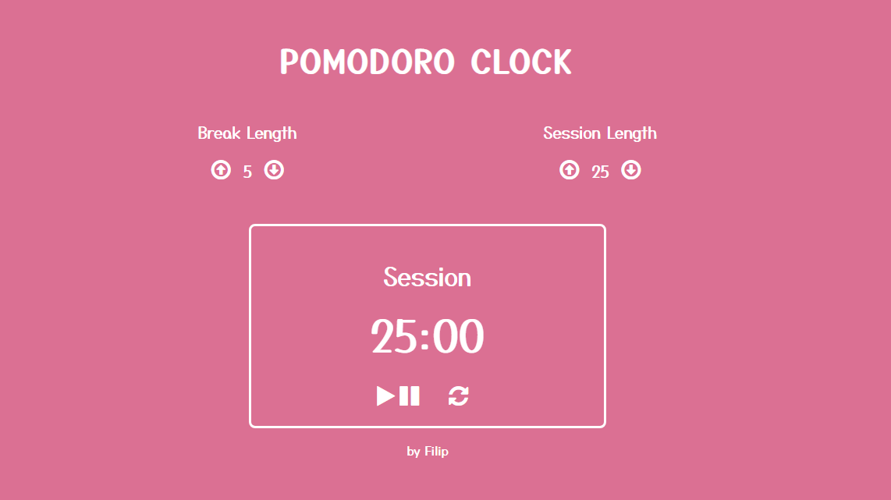

## Pomodoro React-JS Clock

#### A Front-End Project from &ensp; 

 

> See here [The User Stories](https://www.freecodecamp.org/learn/front-end-libraries/front-end-libraries-projects/build-a-25--5-clock) to follow

 

 <https://codepen.io/filip76/pen/qBqBjOE>

 

